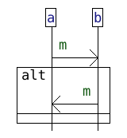
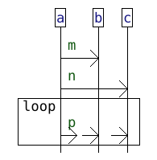
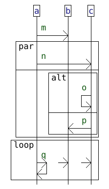
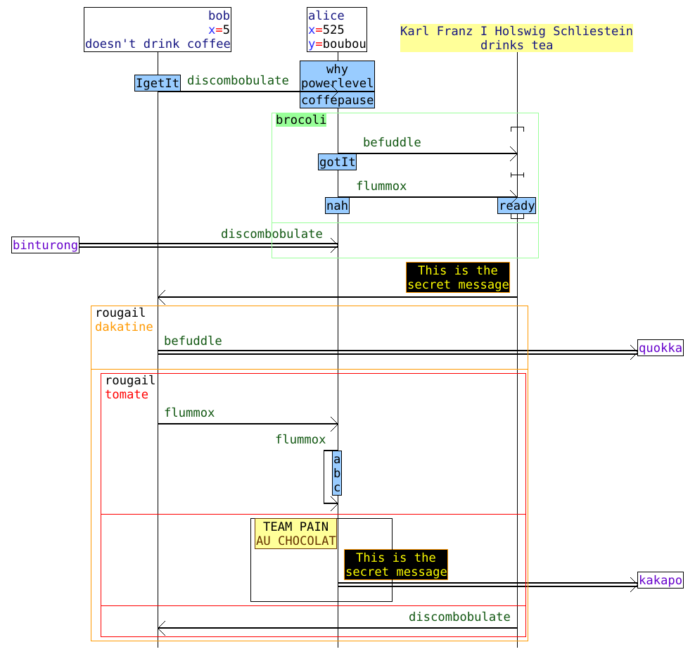

I initially wrote this code for these projects : 
- [hibou_label](https://github.com/erwanM974/hibou_label) 
- [hibou_efm](https://github.com/erwanM974/hibou_efm)
- [hibou_passing](https://github.com/erwanM974/hibou_passing)

Since then I decided to generalize it using generics and repackage it on its own as a library.


# Common IO features for interaction languages

This crates provide generic input (i.e., parsing from text files) and output (i.e., encoding into text and drawing as PNG images) features
for interaction languages.

Interaction Languages are languages that encode distributed processes that can be drawn in the form of Sequence Diagrams 
(such as UML Sequence Diagrams or Message Sequence Charts).

In this crate, we do not define any specific Interaction Language but rather provide an interface that can be implemented for any specific Interaction Language
so as to automatically benefit from the aforementioned IO features.


Interaction Languages such as the one in [hibou](https://github.com/erwanM974/hibou_label) are provided with
a formal semantics.
However, in order to simply parse interactions and draw them (as sequence diagrams), a formal semantics is not necessary : only a syntax is required.


As such, in this library, we do not have any semantic requirement for the Interaction Language.
Only a syntax is required and we also need to know the arity of operators and wether or not any given binary operator is associative.


Below, we give two example languages.


## A minimal Interaction Language

We provide a complete minimal Interaction Language that uses the public interface of this crate in the "src/z_test_minimal_lang/" package.

The atomic "leaves" of this Interaction Language can be either 
the empty interaction,
the emission of a message from a lifeline,
or the reception of a message by a lifeline. 

The language includes the following operators:
- the classical "strict" strict sequencing and "seq" weak sequencing operators 
- the alternative "alt"
- parallel composition "par"
- a "loop"

Except for "loop" which is unary, these 4 operators are binary associative operators.
(see [hibou_label](https://github.com/erwanM974/hibou_label) for details about these operators)


In "src/z_test_minimal_lang/", we use the library interface to implement:
- a parser in "src/z_test_minimal_lang/from_text"
- a printer in "src/z_test_minimal_lang/to_text"
- a drawer in "src/z_test_minimal_lang/to_image"


Generic syntaxic sugar is automatically handled by the parser.

For instance, for any associative binary operator "op", we may write "op(a,b,c)" instead of "op(a,op(b,c))" or "op(op(a,b),c)".

The library code also facilitates handling (i.e., parsing and drawing) of message passing and broadcast patterns (which are important in Interaction Languages).

For instance, a pattern of the form "strict(emission,reception)", if the "emission" and "reception" involve the exact same message, may be automatically interpreted (and drawn) as a message passing arrow. 
Likewise, for "strict(emission,seq(rec1,rec2))" if all three involve the same message, we have a broadcast.


<table>
<tr>
<td> Drawing as a Sequence Diagram </td> <td> Input Text </td> <td> Parsed Internal Representation </td> <td> Interaction Term (in the Minimal Language) </td> 
</tr>
<tr>

<td>



</td>

<td> 

```
seq(
    a -- m -> b,
    alt(
            b -- m -> a,
            0
    )
)
```

</td>
<td>
<h6>

```
Operator(Seq, 
    [
        LeafPattern(BROADCAST(MinimalBroadcastLeafPattern { origin_lf_id: Some(0), msg_id: 0, targets: [1] })), 
        Operator(Alt, 
            [
                LeafPattern(BROADCAST(MinimalBroadcastLeafPattern { origin_lf_id: Some(1), msg_id: 0, targets: [0] })), 
                LeafPattern(EMPTY)
            ]
        )
    ]
)
```

</h6>
</td>

<td>
<h6>

```
Seq(
    Strict(
        Action(MinimalAction { lf_id: 0, ms_id: 0, kind: Emission }), 
        Action(MinimalAction { lf_id: 1, ms_id: 0, kind: Reception })
    ), 
    Alt(
        Strict(
            Action(MinimalAction { lf_id: 1, ms_id: 0, kind: Emission }), 
            Action(MinimalAction { lf_id: 0, ms_id: 0, kind: Reception })
        ), 
        Empty
    )
)
```

</h6>
</td>


</tr>


<tr>

<td>



</td>

<td> 

```
seq(
    a -- m -> b,
    a -- n -> c,
    loop(
        a -- p -> (b,c)
    )
)
```

</td>
<td>
<h6>

```
Operator(Seq,
    [
        LeafPattern(BROADCAST(MinimalBroadcastLeafPattern{origin_lf_id:Some(0),msg_id:0,targets:[1]})),
        LeafPattern(BROADCAST(MinimalBroadcastLeafPattern{origin_lf_id:Some(0),msg_id:1,targets:[2]})),
        Operator(Loop,
            [
                LeafPattern(BROADCAST(MinimalBroadcastLeafPattern{origin_lf_id:Some(0),msg_id:2,targets:[1,2]}))
            ]
        )
    ]
)
```

</h6>
</td>

<td>
<h6>

```
Seq(
    Strict(
        Action(MinimalAction{lf_id:0,ms_id:0,kind:Emission}),
        Action(MinimalAction{lf_id:1,ms_id:0,kind:Reception})
    ),
    Seq(
        Strict(
            Action(MinimalAction{lf_id:0,ms_id:1,kind:Emission}),
            Action(MinimalAction{lf_id:2,ms_id:1,kind:Reception})
        ),
        Loop(
            Strict(
                Action(MinimalAction{lf_id:0,ms_id:2,kind:Emission}),
                Seq(
                    Action(MinimalAction{lf_id:1,ms_id:2,kind:Reception}),
                    Action(MinimalAction{lf_id:2,ms_id:2,kind:Reception})
                )
            )
        )
    )
)
```

</h6>
</td>


</tr>


<tr>

<td>



</td>

<td> 

```
seq(
    a -- m -> b,
    par(
        a -- n -> c,
        alt(
            c -- o -> c,
            c -- p -> b     
        )
    ),
    loop(
        a -- q -> (a,b,c)
    )
)
```

</td>
<td>
<h6>

```
Operator(Seq,
    [
        LeafPattern(BROADCAST(MinimalBroadcastLeafPattern{origin_lf_id:Some(0),msg_id:0,targets:[1]})),
        Operator(Par,
            [
                LeafPattern(BROADCAST(MinimalBroadcastLeafPattern{origin_lf_id:Some(0),msg_id:1,targets:[2]})),
                Operator(Alt,
                    [
                        LeafPattern(BROADCAST(MinimalBroadcastLeafPattern{origin_lf_id:Some(2),msg_id:2,targets:[2]})),
                        LeafPattern(BROADCAST(MinimalBroadcastLeafPattern{origin_lf_id:Some(2),msg_id:3,targets:[1]}))
                    ]
                )
            ]
        ),
        Operator(Loop,
            [
                LeafPattern(BROADCAST(MinimalBroadcastLeafPattern{origin_lf_id:Some(0),msg_id:4,targets:[0,1,2]}))
            ]
        )
    ]
)
```

</h6>
</td>

<td>
<h6>

```
Seq(
    Strict(
        Action(MinimalAction{lf_id:0,ms_id:0,kind:Emission}),
        Action(MinimalAction{lf_id:1,ms_id:0,kind:Reception})
    ),
    Seq(
        Par(
            Strict(
                Action(MinimalAction{lf_id:0,ms_id:1,kind:Emission}),
                Action(MinimalAction{lf_id:2,ms_id:1,kind:Reception})
            ),
            Alt(
                Strict(
                    Action(MinimalAction{lf_id:2,ms_id:2,kind:Emission}),
                    Action(MinimalAction{lf_id:2,ms_id:2,kind:Reception})
                ),
                Strict(
                    Action(MinimalAction{lf_id:2,ms_id:3,kind:Emission}),
                    Action(MinimalAction{lf_id:1,ms_id:3,kind:Reception})
                )
            )
        ),
        Loop(
            Strict(
                Action(MinimalAction{lf_id:0,ms_id:4,kind:Emission}),
                Seq(
                    Action(MinimalAction{lf_id:0,ms_id:4,kind:Reception}),
                    Seq(
                        Action(MinimalAction{lf_id:1,ms_id:4,kind:Reception}),
                        Action(MinimalAction{lf_id:2,ms_id:4,kind:Reception})
                    )
                )
            )
        )
    )
)
```

</h6>
</td>


</tr>
</table>


## A colorful Nonsensical Interaction Language 

The second example language is a nonsensical Interaction Language that we use here to showcase the graphical features of the image drawer interface.
See the implementation in the "src/z_test_colorful/" package with:
- the parser in "src/z_test_colorful/from_text"
- the drawer in "src/z_test_colorful/to_image"

The language has the following operators:
- "TPC" (short for "Team Pain Au Chocolat"), which is a unary operator
- A family of operators that corresponds to all the "Rougail{.}", "." denoting any chain of alphabetic characters. All of these operators are binary and associative.
- "brocoli", which is a non-associative binary operator.
- A co-region operator similar to the one of real-life Interaction Languages (see [hibou_label](https://github.com/erwanM974/hibou_label) ).

Unlike in the previous example Minimal Language, 
here, the atomic actions of this language are already Transmission Events,
but they also include accompagnying notes about something more or less related
and they can involve outside gates in addition to lifelines.


<table>
<tr>
<td> Drawing as a Sequence Diagram </td> <td> Input Text </td>
</tr>

<tr>

<td> 

</td> 

<td>

```
seq(
    {IgetIt}bob--discombobulate->{why;powerlevel}alice{coffepause},
    brocoli(
        cr{carl}(
            alice{gotIt}--befuddle->carl,
            alice{nah}--flummox->carl{ready}
        ),
        binturong--discombobulate->alice
    ),
    carl--secret->bob,
    rougail{dakatine}(
        bob--befuddle->quokka,
        rougail{tomate}(
            seq(
                bob--flummox->alice,
                alice{a;b;c}--flummox->alice
            ),
            TPC(
                alice--secret->kakapo
            ),
            carl--discombobulate->bob
        )
    )
)
```

</td>

</tr>

</table>


## Dependencies

This is a pure Rust library.

The other pure Rust crates it depends on are:
- for the parser : [nom](https://crates.io/crates/nom) 
- for the drawer : [image](https://crates.io/crates/image) (and other crates in its ecosystem)


